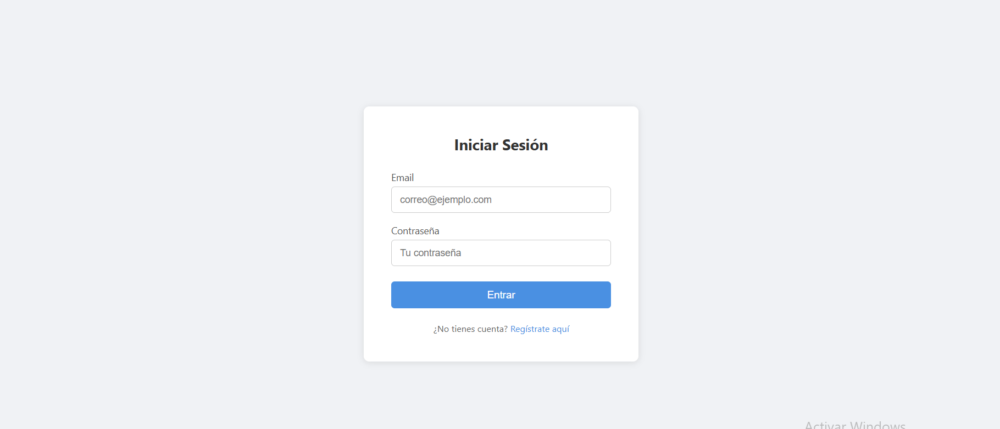
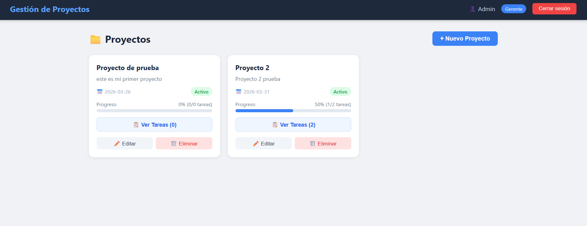
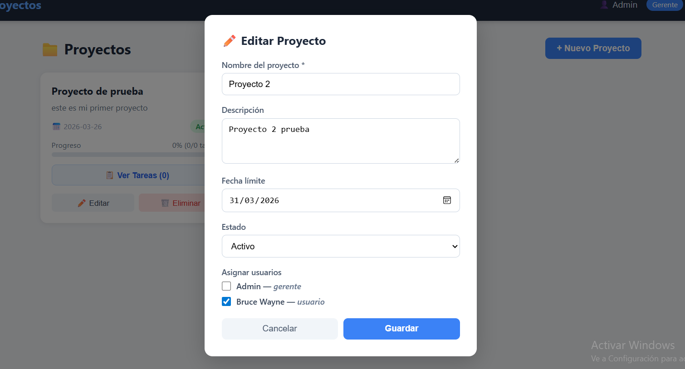

# 📋 Sistema de Gestión de Proyectos

Aplicación web desarrollada con **React** y **Next.js** que permite gestionar proyectos y tareas de manera simple, con autenticación de usuarios y roles diferenciados.

---

## 👥 Equipo de Desarrollo — Equipo 12

| Nombre | Rama | Responsabilidad |
|---|---|---|
| Nelson Henriquez | `Parte-de-Nelson` | Setup, autenticación y configuración del proyecto |
| Diego Nochez | `Diego` | Dashboard, CRUD de proyectos e interfaz responsiva |
| Jimmy Pineda | `Jimmy-M` | CRUD de tareas, integración API REST y despliegue |

---

## 🚀 Tecnologías Utilizadas

- **React 19** — Librería para construir la interfaz de usuario
- **Next.js 16** — Framework para el enrutamiento y estructura del proyecto
- **Axios** — Cliente HTTP para comunicación con la API
- **JSON Server** — API REST simulada como base de datos
- **CSS puro** — Estilos personalizados y diseño responsivo
- **GitHub** — Control de versiones con ramas por integrante
- **Vercel** — Despliegue de la aplicación

---

## 📁 Estructura del Proyecto

```
SistemaGestionProyectos_DPS/
├── components/
│   ├── Navbar.js          # Barra de navegación con usuario, rol y logout
│   ├── ProjectCard.js     # Tarjeta de proyecto con barra de progreso
│   ├── ProjectModal.js    # Modal para crear y editar proyectos
│   ├── ProtectedRoute.js  # Protección de rutas autenticadas
│   └── Taskmodal.js       # Modal para crear y editar tareas
├── context/
│   └── AuthContext.js     # Contexto global de autenticación
├── pages/
│   ├── _app.js            # Componente raíz con AuthProvider
│   ├── index.js           # Redirección según autenticación
│   ├── login.js           # Página de inicio de sesión
│   ├── register.js        # Página de registro de usuarios
│   ├── dashboard.js       # Dashboard principal con lista de proyectos
│   └── task/
│       └── [id].js        # Vista de tareas por proyecto
├── services/
│   └── api.js             # Instancia de Axios y funciones CRUD
├── styles/
│   ├── globals.css        # Estilos globales
│   ├── login.css          # Estilos del login
│   ├── register.css       # Estilos del registro
│   └── dashboard.css      # Estilos del dashboard
└── db.json                # Base de datos simulada (JSON Server)
```

---

## ⚙️ Cómo ejecutar la app localmente

### Requisitos previos
- Tener instalado **Node.js** (v18 o superior) → [https://nodejs.org](https://nodejs.org)
- Tener instalado **Git** → [https://git-scm.com](https://git-scm.com)

### Pasos

**1. Clonar el repositorio:**
```bash
git clone https://github.com/DiegoNochez/SistemaGestionProyectos_DPS.git
cd SistemaGestionProyectos_DPS
```

**2. Instalar dependencias:**
```bash
npm install
```

**3. Abrir dos terminales y ejecutar:**

Terminal 1 — JSON Server (base de datos):
```bash
npx json-server db.json --port 3001
```

Terminal 2 — Next.js (aplicación):
```bash
npm run dev
```

**4. Abrir en el navegador:**
```
http://localhost:3000
```

### Credenciales de prueba
| Email | Contraseña | Rol |
|---|---|---|
| admin@gmail.com | 1234 | Gerente |

---

## 🔐 Funcionalidades

### Autenticación
- Registro de nuevos usuarios con nombre, email, contraseña y rol
- Inicio de sesión con validación de credenciales
- Sesión persistente usando `localStorage`
- Rutas protegidas — redirige al login si no está autenticado

### Roles
| Acción | Gerente | Usuario |
|---|---|---|
| Ver proyectos asignados | ✅ | ✅ |
| Crear/editar/eliminar proyectos | ✅ | ❌ |
| Ver tareas del proyecto | ✅ | ✅ |
| Crear/editar/eliminar tareas | ✅ | ❌ |
| Actualizar estado de tareas | ✅ | ✅ |

### Gestión de Proyectos
- Dashboard con lista de proyectos en tarjetas
- Crear, editar y eliminar proyectos (solo Gerente)
- Barra de progreso visual basada en tareas completadas
- Estados: Activo, Pausado, Completado
- Asignación de usuarios a proyectos

### Gestión de Tareas
- Lista de tareas por proyecto
- Crear, editar y eliminar tareas (solo Gerente)
- Actualizar estado de tareas: Pendiente, En Progreso, Completada
- Asignación de tareas a usuarios específicos

---

## 🌐 Enlace de Despliegue

> 🔗 [https://sistema-gestion-proyectos-dps.vercel.app](https://sistema-gestion-proyectos-dps.vercel.app)
---
> ⚠️ Nota: El frontend está desplegado en Vercel. 
> Para usar la app completa es necesario correr JSON Server localmente 
> siguiendo los pasos de instalación.
---

## 📸 Capturas de Pantalla

### Login


### Dashboard


### Modal Nuevo Proyecto


---

## 📄 Licencia

Proyecto académico — Desarrollo de Páginas y Sistemas Web  
Universidad Don Bosco — 2026